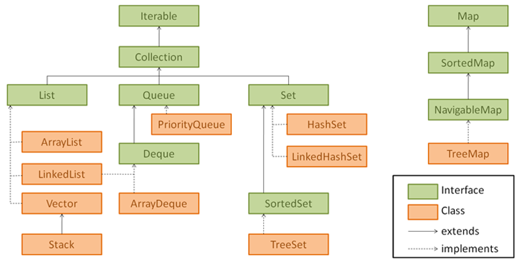
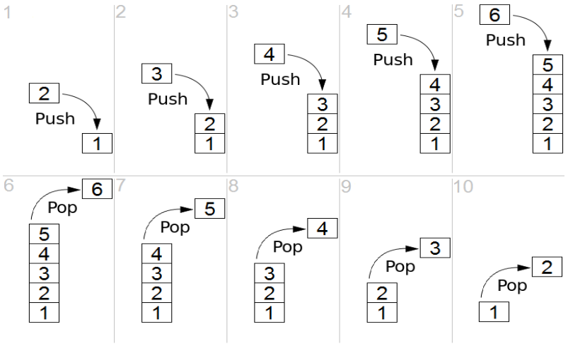
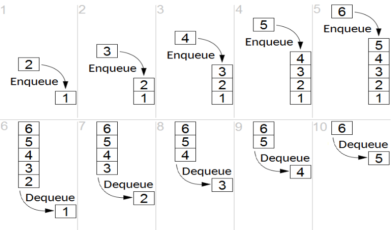

==== Listy, Sety, Mapy i Kolejki

(Lists, Sets, Maps, Queues )

* Kolekcja (collection) to zbiór obiektów, przechowywanych w jednym obiekcie.
* Java Collection Framework, jest zbiorem klas, znajdujących się w pakiecie ``java.util``, służących do przechowywania obiektów kolekcji.
* Collection to interfejs w Javie, po którą dziedziczą wszystkie klasy należące do Java Collection Framework za wyjątkiem interfejsu Map (ale należy on do tego frameworku)
* istnieje również klasa narzędziowa Collections, w której znajdziemy pomocnicze dla kolekcji metody takie jak np.
Collections.singletonList() czy Collections.emptyList(), ale również np.
Collections.sort() Wyróżniamy 4 główne interfejsy, należące do Java Collections Framework:

* Lista (List)

Funkcjonalność listy to przechowywanie elementów w określonej kolejności (wedle kolejności wstawiania, o ile nie wykonamy na niej sortowania), pozwalającej na przechowywanie wielokrotnie instancji tego samego obiektu (dopuszczająca duplikaty), do których dostęp można uzyskać poprzez index (czyli numer pozycji w danej liście)

* Zbiór (Set)

Zbiór to kolekcja, której zadaniem jest przechowywanie unikatowych elementów, w związku z czym nie dopuszcza ona do umieszczania duplikatów

* Kolejka (Queue)

Kolekcja przechowująca elementy w określonej kolejności, która najczęściej określa pierwszeństwo podczas przekazywania do wykonania (processing).
Najczęśniej spotykana kolejka konsumuje w kolejności pierwszy który wejdzie pierwszy ją opuszcza (first-in, first-out, tzw.
FIFO), ale spotykane są również inne warianty jak np. last-in, first-out (LIFO)

* Mapa (Map)

Mapa to rodzaj kolekcji przechowującej zbiór danych typu klucz-wartość (key/value).
Oznacza to, że z danym kluczem może być powiązana w danym momencie tylko jedna wartość (ale nic nie stoi na przeszkodzie, by wartością tą była np. lista).
Ponadto jedna wartość może byc powiązana z wieloma kluczami

Metody pochodzące z interfejsu Collection (czyli używane w List, Set, Queue)

* boolean add(E element) - dodanie elementu do danej kolekcji, zwraca prawdę jeśli dodano do kolekcji, fałsz jeśli nie

[source,java]
----
Set<String> setExample = new HashSet<>();
System.out.println(setExample.add("val")); //true
System.out.println(setExample.add("val")); //true

List<String> listExample = new ArrayList<>();
System.out.println(listExample.add("val")); //true
System.out.println(listExample.add("val")); //false

Queue<String> que = new ArrayDeque<>();
System.out.println(que.add("val")); //true
System.out.println(que.add("val")); //true
----

* boolean remove(E element) - usunięcie elementu kolekcji, zwraca prawdę jesli jakiś element został usunięty

[source,java]
----
List<String> list = new ArrayList<>();
System.out.println(list.add("bow")); //true
System.out.println(list.add("bow")); //true
System.out.println(list); //[bow, bow]

System.out.println(list.remove("sword")); //false
System.out.println(list); //[bow, bow]

System.out.println(list.remove("bow")); //true
System.out.println(list);   //[bow}
----

* boolean isEmpty() - określa czy dana kolekcja jest pusta

* int size() - określa ilość obiektów aktualnie przechowywanych w kolekcji

[source,java]
----
List<String> birds = new ArrayList<>();
System.out.println( birds.isEmpty()); // true
System.out.println( birds.size());// 0

birds.add("hawk"); // [hawk]
birds.add("hawk"); // [hawk, hawk]

System.out.println( birds.isEmpty()); // false
System.out.println( birds.size());// 2
----

* void clear() - usuwa wszystkie elementy z kolekcji

* boolean contains(Object object) - sprawdza czy dany element znajduje się w kolekcji, wykorzystuje metodę equals do sprawdzenia

=== List

|===
| Metoda                                | Opis
| void add( E element)                  | Dodaje element na koniec listy
| void add( int index, E element)       | Dodaje element pod konkretnym indeksem, reszta przesuwa się "w prawo"
| E get( int index)                     | Zwraca element pod wskazanym indeksem
| int indexOf( Object o)                | Zwraca pierwszy indeks, dla którego equals zwróci prawdę, -1 jeśli nie znaleziono
| int lastIndexOf( Object o)            | Ostatni pasujący indeks, -1 jeśli brak wyników
| void remove( int index)               | Usunięcie elementu znajdującego się pod wskazanym indeksem, reszta przesuwa się "w lewo"
| E set( int index, E e)                | Zastąpienie elementu pod wskazanym indeksem, zwraca ten który znajdował się tam przed zastąpieniem
|===

Zadanie 1:

W ramach klasy ListRunner:

1. W metodzie public static List<Integer> oddRandomNumbers(), utwórz listę liczb całkowitych.
2. Wypełnij ją dwudziestoma wylosowanymi liczbami z zakresu <0, 10>.
3. Wyświetl zawartość listy.
4. Usuń z listy wszystkie liczby parzyste.
5. Wyświetl zawartość listy

Zadanie 2:
1. Utwórz metodę List<String> removeDuplicates(List<String> list).
2. Metoda na podstawie listy przekazanej w parametrze powinna zwrócić nową listę bez duplikatów.
3. Przetestuj metodę za pomocą testów jednostkowych.

=== Set

Set nie posiada standardowo dodatkowych metod, aczkolwiek w przypadku `TreeSet` który implementuje interfejs `NavigableSet`, dochodzą następujące metody:

|===
| Metoda                | Opis
| E lower( E e)         | Zwraca największy element mniejszy od zadanego e, lub null w przypadku braku wyniku
| E floor( E e)         | Zwraca największy element mniejszy lub równy zadanemu e, lub null w przypadku braku wyniku
| E ceiling( E e)       | Zwraca najmniejszy element większy lub równy zadanemu e, lub null w przypadku braku wyniku
| E higher( E e)        | Zwraca najmniejszy element większy od zadanego e, lub null w przypadku braku wyniku
|===

//wymyslimy jakies zadanie live ;) HashSet + TreeSet, equals + compareTo

=== Queue

(wkrótce...)

Poniżej: zasada działania stosu, tzw. LIFO - Last In First Out

Kolejka:
tzw. FIFO - First In First Out

Zadanie

Stwórz klasę Clinic, reprezentującą przychodnie.

1. Klasa, jako pole powinna zawierać kolejkę imion pacjentów.
2. W Clinic utwórz metodę registerPatient(String name), która doda pacjenta do kolejki.
3. Dodaj kolejną metodę String handlePatient(), która zwróci imię obsługiwanego pacjenta i usunie go z kolejki.
4. Przetestuj przychodnie za pomocą testów jednostkowych.
5. *Rozszerz system o klasę Doctor zawierającą oprócz danych osobowych, historię wizyt. Forma dowolna.

=== Map

Metody interfejsu Map nie są związane z interfejsem Collections, aczkolwiek definiują interfejs w pewnych miejscach z nim zgodny

|===
| Metoda                            | Opis
| void clear()                      | Usuwa wszystkie klucze i wartości z mapy
| boolean isEmpty()                 | Sprawdza czy mapa jest pusta
| int size()                        | Ilość par klucz / wartość w mapie
| V get( Object key)                | Zwraca wartość powiązaną z danym kluczem, lub null jeśli takiej nie ma
| V put( K key, V value)            | Dodaje lub zastępuje parę klucz/wartość. Zwraca poprzednią wartość powiązaną z danym kluczem, lub null
| V remove(Object key)              | Usuwa z mapy oraz zwraca wartość powiązaną z danym kluczem, lub null jeśli wartość nie istniała
| boolean containsKey( Object key)  | Sprawdza czy w mapie znajduje się podany klucz
| boolean containsValue( Object)    | Sprawdza czy wartość znajduje się w mapie
| Set < K > keySet()                | Zwraca zbiór (set) wszystkich kluczy
| Collection < V > values()         | Zwraca kolekcję wszystkich wartości
| Set<Entry<K,V>> entrySet()        | Zwraca zbiór obiektów reprezentujących pary klucz/wartość w danej mapie

Boyarsky, Jeanne; Selikoff, Scott. OCP: Oracle Certified Professional Java SE 8 Programmer II Study Guide: Exam 1Z0-809 (Kindle Locations 5409-5419). Wiley. Kindle Edition.
|===

Zadanie 1:
Stwórz klasę PersonMap
1. W metodzie main utwórz mapę <Long, String>, gdzie docelowo klucz będzie reprezentował id, a wartość imię.
2. Dodaj rekordy(pary) do mapy, tak aby kilka z nich zawierało w wartości imię na literę A.
3. Korzystając z mapy, wyświetl wszystkie imiona zaczynające się na literę A.
4. Jeśli jest taka potrzeba, dodaj do mapy rekordy tak aby imię „Jan” występowało kilkukrotnie.
5. Korzystając z mapy, wyświetl wszystkie id, które przechowują wartość „Jan”.

Zadanie 2:

1. Stwórz klasę Student(firstname, lastname, mainLanguage).
2. W metodzie main:
    • Utwórz mapę, gdzie kluczem będzie Student, a wartością lista jego ocen.
    • Stwórz kilku studentów oraz ich oceny, a następnie dodaj do mapy.
    • Wyświetl zawartość mapy na konsoli, tak aby w miarę czytelnie dało się odczytać studentów oraz ich oceny. Np. Jan Nowak PL – 2, 3, 5, 5, 4
3 Utwórz klasę StudentService zawierająca poniższe metody.
• double calculateAverage(List<Integer> grades) – metoda oblicza średnią ocen
• double calculateTotalAverage(Map<Student, List<Integer>> studentToGrades) – metoda oblicza średnią wszystkich ocen
• Student findBestStudent(Map<Student, List<Integer>> studentToGrades) – metoda zwraca studenta z najlepszą średnią

== Porównanie typów kolekcji między sobą

|===
|Typ    |duplikaty?     |uporządkowana ?                        |klucze i wartości ?|Narzucona kolejność dodawania / usuwania?
|List   |tak            |tak (wedle indeksu)                    |nie                |nie
|Map    |tak (wartości) |nie                                    |tak                |nie
|Queue  |tak            |tak (zwracana w określonej kolejności) |nie                |tak (nie można wyciągać elementów ze środka)
|Set    |nie            |nie                                    |nie                |nie
|===

== Porównanie implementacji pomiędzy sobą:

|===
| Typ           | interface     | posortowana   | wymagany hashcode     | używa compareTo ? | null jako wartość
| ArrayList     | List          | nie           | nie                   | nie               | tak
| ArrayDeque    | Queue         | nie           | nie                   | nie               | nie (oznaczenie pustej listy)
| HashMap       | Map           | nie           | tak                   | nie               | nie (klucze i wartości)
| HashSet       | Set           | nie           | tak                   | nie               | tak
| HashTable     | Map           | nie           | tak                   | nie               | tak
| LinkedList    | List, Queue   | nie           | nie                   | nie               | tak
| Stack         | List          | nie           | nie                   | nie               | tak
| TreeMap       | Map           | tak           | nie                   | tak               | nie (klucz)
| TreeSet       | Set           | tak           | nie                   | tak               | nie
| Vector        | List          | nie           | nie                   | nie               | tak
|===

Czy zastanawialiście się kiedyś skąd pętla foreach wie jak przechodzić po kolejnych elementach, no właśnie, kolejkcji ? tabeli ?
Odpowiedź jest prosta – obiekty po których można iterować posiadają zaimplementowany interfejs Iterable<T> wraz z następującymi metodami: iterator, hasNext, next (innymi słowy pętla foreach to nakładka na przeglądanie elementów zbioru przy pomocy iteratora)

[source,java]
----
public static void removeNegative(List<Double> v) {
    for (Iterator<Double> it = v.iterator(); it.hasNext();) {
        if (it.next() < 0){
            it.remove();
        }
    }
}
----

Pytania kontrolne
1. Z jakiej listy skorzystasz, jeśli masz pewność że będzie ona bardzo często modyfikowana, natomiast dane z niej będą pobierane stosunkowo rzadko?
2. Który ze zbiorów wybierzesz, aby zachować kolejność dodanych elementów?
3. Który ze zbiorów wybierzesz, aby domyślnie przejść po posortowanych elementach?
4. Który ze zbiorów wybierzesz, jeśli kolejność nie ma znaczenia a zależy Ci na szybkości?
5. Czy w TreeMap wartości będą posortowane?